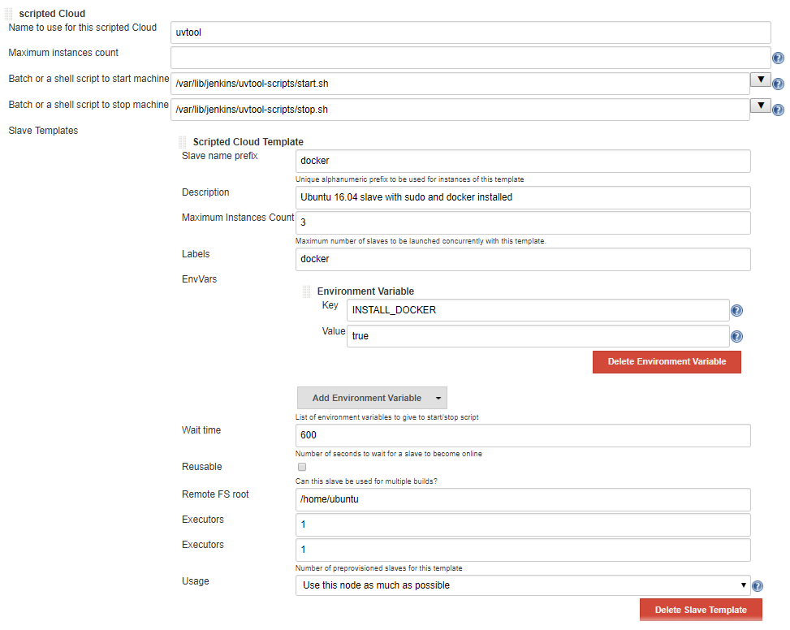

scripted-cloud-plugin
=====================

## About
With this plugin it is very easy to integrate your own cloud to launch Jenkins slaves. 
The only requirement is that you are able to start and stop the slaves via a batch script.
It supports both the definition of static, unique slaves; as dynamic, templated-based ones.

## Motivation
1. You've got several pre-configured VMs to act as slave, their configuration are essentially different
2. You don't want to have them running 100% time
3. These VMs are distributed across several clouds

## Overview

This plugin lets you to define your own scripts to run your VMs and stops them whenever they are not needed.

The plugin defines a new node type "Scripted Cloud Node". 

You can define any environment variable to pass on to the script.

## User Guide

### General

After installing the plugin, go to `Manage Jenkins` > `Configure System` > `Clouds` to define a new *Scripted Cloud*. 
You can either directly enter the start- and stop-script there, or enter the path to your scripts on disk.

### Dynamic slaves

When you want the slaves to be dynamically provisioned based on a template, choose `Add Slave Template`. 

### Static slaves

To add a node, go to `Manage Jenkins` > `Manage Nodes` > `New Node` and choose `Slave virtual computer running on scripted cloud`. You can configure which scripted cloud to use in the next screen of the wizard.

**Attention:** When `reusable` is turned off, this node will be deleted after the next usage.
